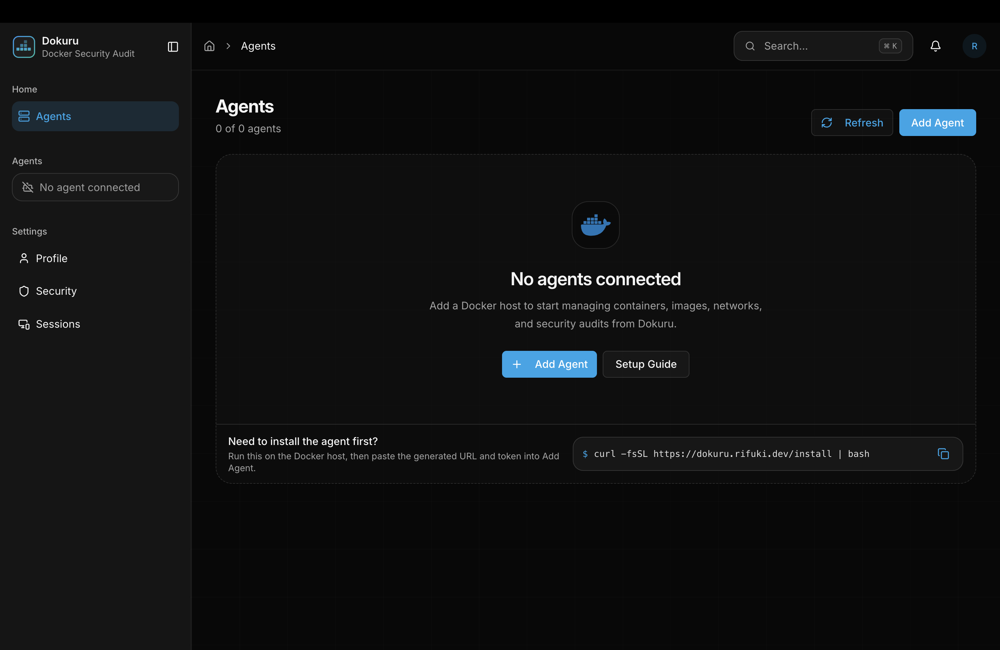
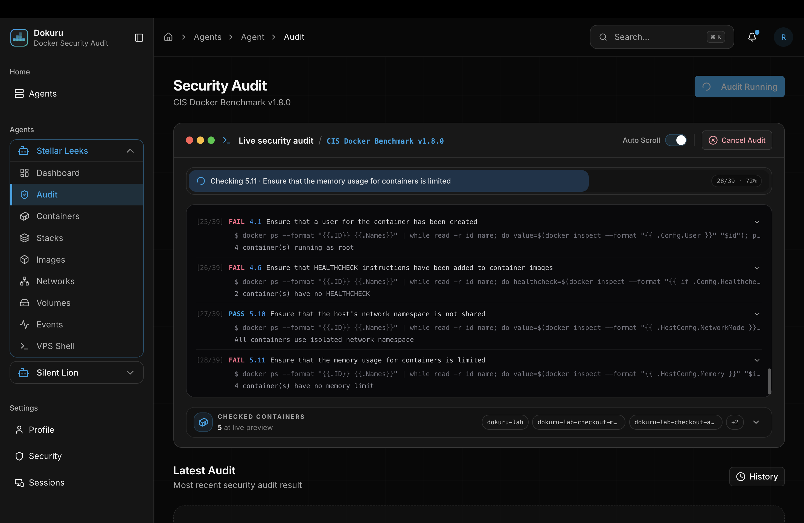
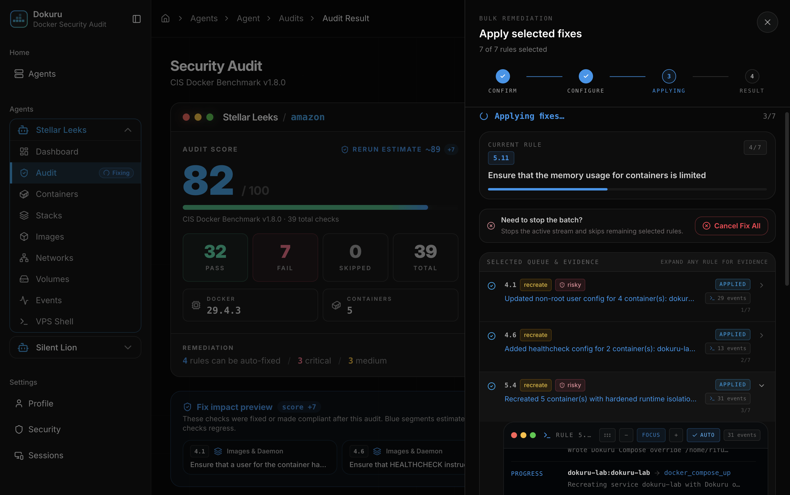
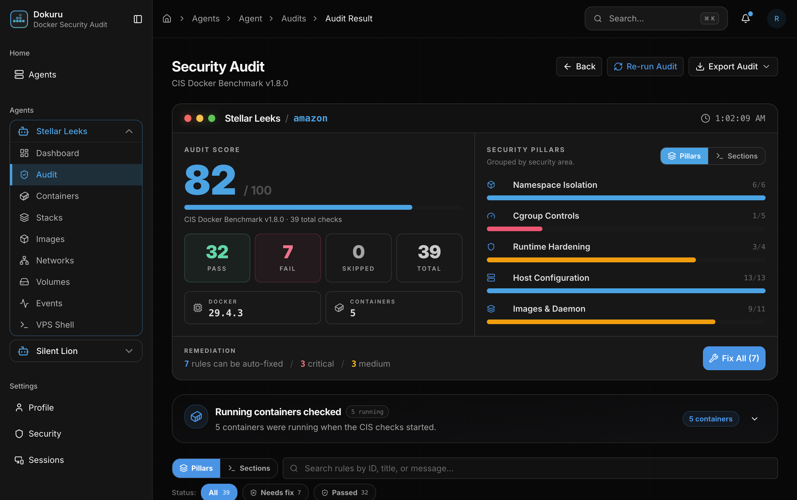

# Dokuru

**Agent-based Docker security audit and hardening platform.**

[](https://github.com/rifuki/dokuru/actions/workflows/ci.yaml)

Dokuru audits Docker hosts against a pragmatic, CIS Docker Benchmark v1.8.0 aligned rule set, shows rule-level evidence, and applies supported hardening changes through a controlled preview, stream, history, and rollback workflow.

The project is designed for real Docker hosts, not only static reporting:

- Audit host configuration, Docker daemon settings, daemon file permissions, image/runtime posture, namespaces, and cgroups.
- Manage one or more Docker hosts from a hosted dashboard or the agent's embedded local dashboard.
- Connect agents by direct URL, Cloudflare Tunnel, or outbound relay WebSocket for hosts behind NAT.
- Preview fixes before mutation, stream each remediation step, and retain rollback metadata where the fix path can capture it.
- Keep all Docker socket access inside `dokuru-agent`; the server never needs the host Docker socket.

> Dokuru can change Docker daemon configuration, audit rules, Compose files, Dockerfiles, container runtime settings, and cgroup limits. Run it only on infrastructure you control, test fixes in staging first, and treat every agent token as a secret.

## Preview

<p>
  
</p>

<p>
  
  
</p>

<p>
  
</p>

See the [screenshot gallery](docs/screenshots.md) for the full visual walkthrough.

## Install

Dokuru can be used in two operating modes:

| Mode | Server required | Best for | Access path |
| --- | --- | --- | --- |
| Hosted | Yes | Teams, multiple hosts, stored audit history, admin views | Browser to `dokuru-www`, then server to agent by relay or direct URL. |
| Direct | No | Single host, local/private operation, quick inspection | Browser directly to the agent dashboard on port `3939`. |

Install the agent on a Docker host:

```bash
curl -fsSL https://dokuru.rifuki.dev/install | bash
```

The onboarding wizard installs the `dokuru` binary, creates `/etc/dokuru/config.toml`, generates a `dok_...` agent token, starts the systemd service, and prints the agent URL/token needed by the dashboard.

For the complete setup guide, see [docs/installation.md](docs/installation.md).

## Documentation

| Topic | Link |
| --- | --- |
| Installation and quick start | [docs/installation.md](docs/installation.md) |
| Architecture and connection modes | [docs/architecture.md](docs/architecture.md) |
| Audit and remediation flow | [docs/audit-remediation.md](docs/audit-remediation.md) |
| Configuration | [docs/configuration.md](docs/configuration.md) |
| API surface | [docs/api.md](docs/api.md) |
| Security best practices | [docs/security.md](docs/security.md) |
| Development and releases | [docs/development.md](docs/development.md) |
| Product scope | [docs/product-scope.md](docs/product-scope.md) |
| Screenshot gallery | [docs/screenshots.md](docs/screenshots.md) |

## Repository Map

| Component | Path | Role |
| --- | --- | --- |
| Agent | `dokuru-agent/` | Rust CLI and daemon installed on Docker hosts. Owns Docker socket access, audits, fix execution, local API, embedded dashboard, host shell, and relay client. |
| Server | `dokuru-server/` | Rust/Axum control plane. Owns users, JWT sessions, PostgreSQL persistence, Redis token blacklist, stored audit history, notifications, admin APIs, and agent relay. |
| Web Dashboard | `dokuru-www/` | React/TanStack dashboard. Owns agent onboarding UI, Docker resource pages, audit reports, FixWizard, realtime streams, settings, and admin views. |
| Landing Site | `dokuru-landing/` | Leptos/Trunk public site for the hosted product and installer handoff. |
| Deploy CLI | `dokuru-deploy/` | Rust helper for production Compose deployment, migration, health checks, config repair, and release updates. |
| Shared Core | `dokuru-core/` | Shared audit report DTOs and scoring helpers used by server-side report views. |

## License

Dokuru is licensed under the Elastic License 2.0. See [LICENSE](LICENSE) for the full terms.
