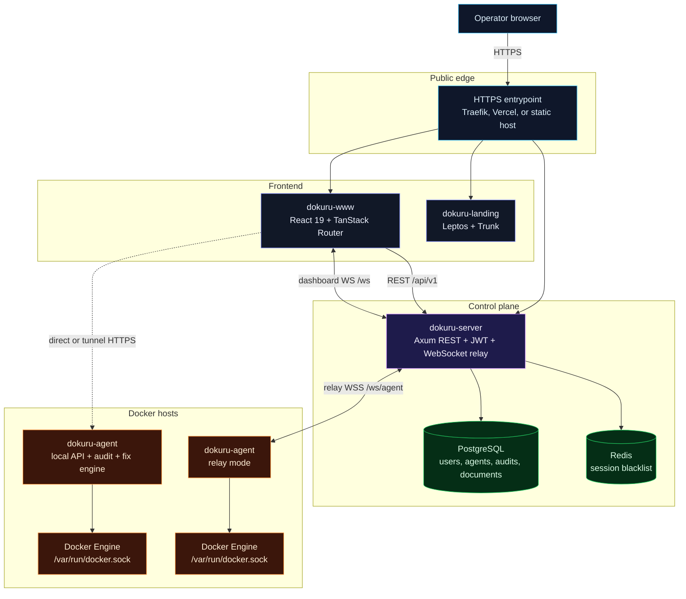
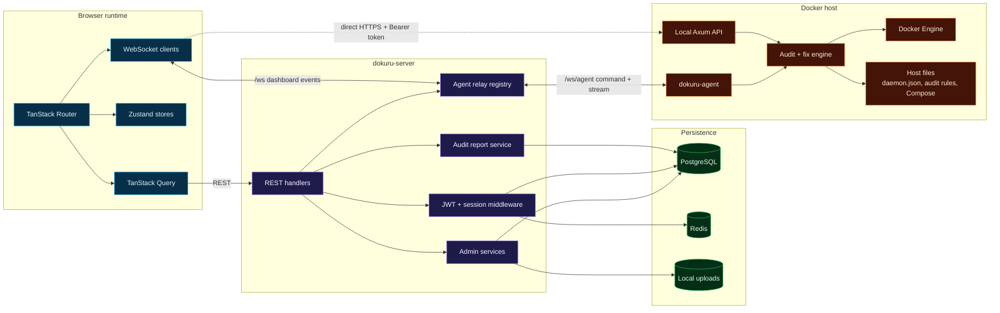
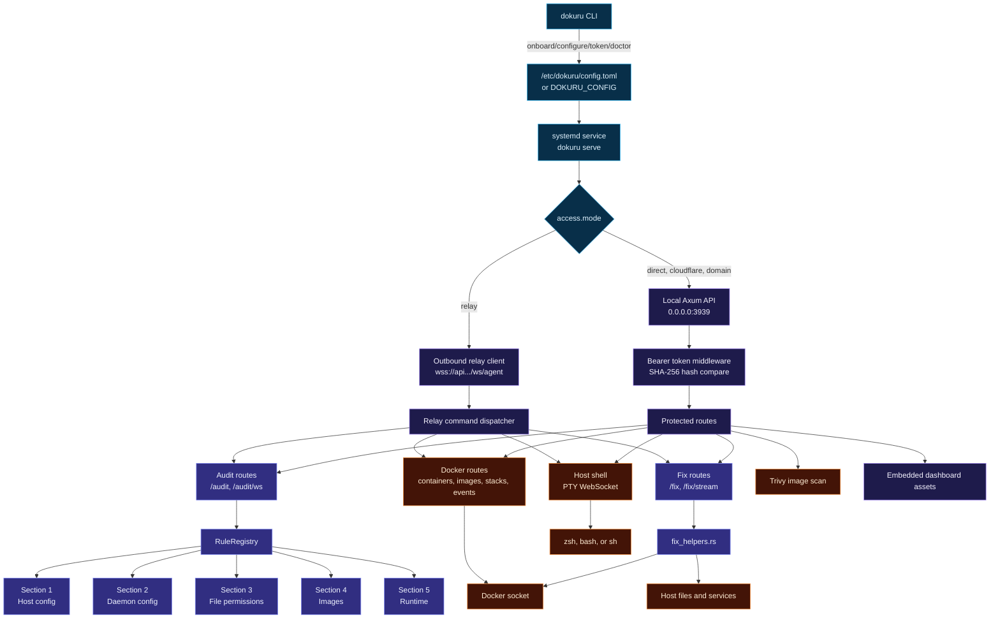
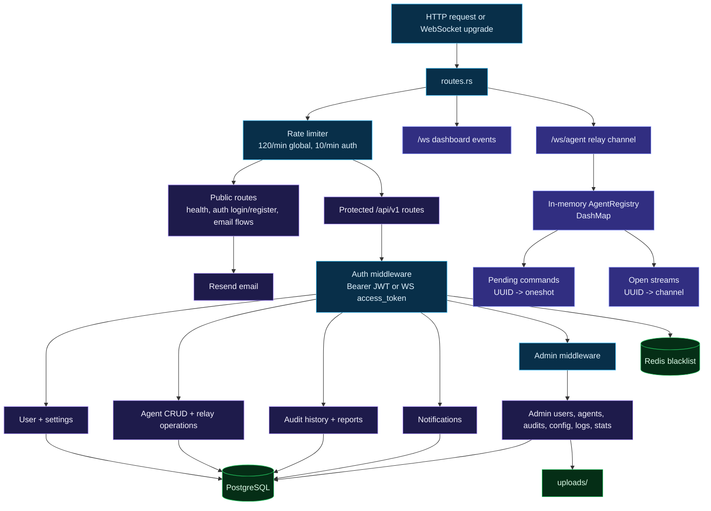
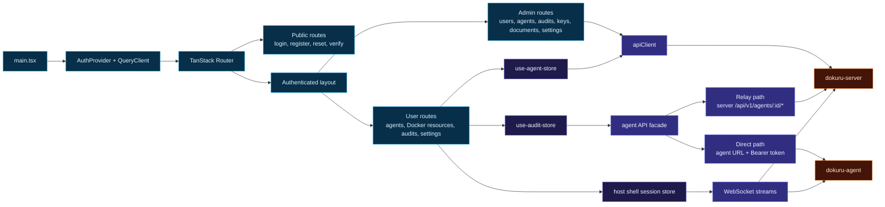
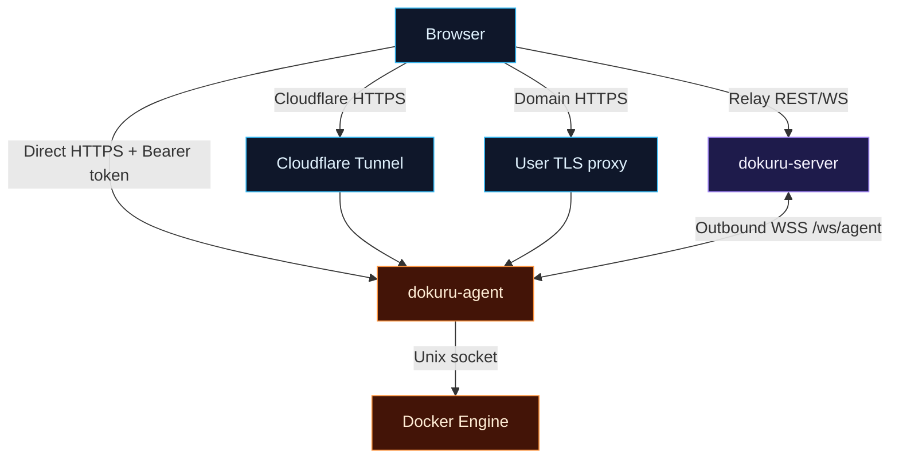
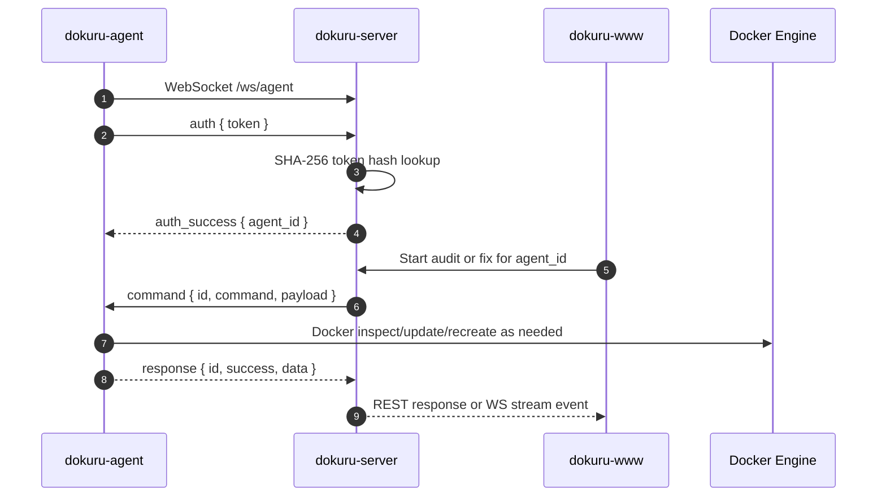

# Architecture

## System Overview


Dokuru's core product path has three runtime components, a public landing site, a deployment helper, and one shared library:

| Component | Path | Role |
| --- | --- | --- |
| Agent | `dokuru-agent/` | Rust CLI and daemon installed on Docker hosts. Owns Docker socket access, audits, fix execution, local API, embedded dashboard, host shell, and relay client. |
| Server | `dokuru-server/` | Rust/Axum control plane. Owns users, JWT sessions, PostgreSQL persistence, Redis token blacklist, stored audit history, notifications, admin APIs, and agent relay. |
| Web Dashboard | `dokuru-www/` | React/TanStack dashboard. Owns agent onboarding UI, Docker resource pages, audit reports, FixWizard, realtime streams, settings, and admin views. |
| Landing Site | `dokuru-landing/` | Leptos/Trunk public site for the hosted product and installer handoff. |
| Deploy CLI | `dokuru-deploy/` | Rust helper for production Compose deployment, migration, health checks, config repair, and release updates. |
| Shared Core | `dokuru-core/` | Shared audit report DTOs and scoring helpers used by server-side report views. |

The important boundary is simple: `dokuru-server` coordinates and persists, `dokuru-www` presents and streams, and `dokuru-agent` performs privileged host work.



## Repository Map


```text
dokuru/
|-- README.md
|-- docker-compose.yaml              Production-oriented Compose stack
|-- docker-compose.override.yaml     Local development override
|-- rust-toolchain.toml              Rust 1.95.0, rustfmt, clippy
|-- dokuru-agent/                    Host-side Rust agent and CLI
|-- dokuru-server/                   Axum backend and relay server
|-- dokuru-www/                      React dashboard and embedded agent UI
|-- dokuru-landing/                  Public landing and install handoff site
|-- dokuru-deploy/                   Production Compose deployment helper
|-- dokuru-core/                     Shared audit report model
|-- docs/                            Operator and developer documentation
`-- .github/workflows/              CI, GHCR image builds, releases, deploy hooks
```

### `dokuru-agent`

`dokuru-agent` builds the `dokuru` binary. It runs as a CLI during onboarding and as a long-lived daemon after installation.

Main responsibilities:

- Generate and rotate `dok_...` agent tokens.
- Write `/etc/dokuru/config.toml` and a systemd service.
- Serve a local token-protected API on port `3939` by default.
- Serve an embedded `dokuru-www` build in `VITE_DOKURU_MODE=agent`.
- Connect to Docker through `/var/run/docker.sock` with Bollard.
- Run the CIS-aligned audit registry and remediation helpers.
- Stream audit, fix, Docker events, container exec, and host shell sessions over WebSocket.
- Connect outbound to `dokuru-server` when relay mode is selected.

Important source areas:

| Area | Path | Notes |
| --- | --- | --- |
| CLI entrypoint | `dokuru-agent/src/main.rs` | `onboard`, `configure`, `doctor`, `status`, `audit`, `version`, `token`, `config`, `restart`, `update`, `uninstall`, `serve`. |
| Local API | `dokuru-agent/src/api/` | Axum routes, auth middleware, CORS, relay client, embedded assets. |
| Audit registry | `dokuru-agent/src/audit/rule_registry/` | Section 1 through 5 rule definitions. |
| Fix engine | `dokuru-agent/src/audit/fix_helpers.rs` | Docker update, Compose patch/override, recreate, auditd, daemon config, rollback/history. |
| Docker API | `dokuru-agent/src/docker/` | Containers, images, networks, volumes, stacks, events. |
| Host shell | `dokuru-agent/src/host_shell.rs` | PTY-backed host shell used by the dashboard. |

### `dokuru-server`

`dokuru-server` is the hosted control plane and relay. It does not need direct Docker socket access.

Main responsibilities:

- User registration, login, refresh, logout, password reset, email verification, and session management.
- JWT access tokens and HTTP-only refresh cookie flow.
- Optional Redis-backed token blacklist for revoked sessions.
- Agent CRUD and token hash matching.
- Stored audit history and normalized report views via `dokuru-core`.
- WebSocket relay between the browser and relay-mode agents.
- Dashboard event broadcast for agent status, audit completion, and notifications.
- Admin views for users, agents, audits, documents, config, logs, and stats.

Important source areas:

| Area | Path | Notes |
| --- | --- | --- |
| Entrypoint | `dokuru-server/src/main.rs` | Config load, logging, state, bootstrap admin, graceful shutdown. |
| Router | `dokuru-server/src/routes.rs` | `/health`, `/ws`, `/ws/agent`, `/api/v1/*`, `/media/*`. |
| App state | `dokuru-server/src/state.rs` | Config, DB, Redis, services, agent registry, WS manager. |
| Agent relay | `dokuru-server/src/feature/agent/relay.rs` | Command/response and stream bridging over WebSocket. |
| Auth | `dokuru-server/src/feature/auth/` | Argon2, JWT, sessions, refresh cookie. |
| Persistence | `dokuru-server/migrations/` | Users, sessions, API keys, agents, audits, documents, notifications. |

### `dokuru-www`

`dokuru-www` is a Vite SPA used in two modes:

| Mode | Build variable | Behavior |
| --- | --- | --- |
| Cloud dashboard | `VITE_DOKURU_MODE=cloud` | Talks to `dokuru-server` for auth, agent registry, audit history, relay routes, and dashboard events. |
| Embedded agent UI | `VITE_DOKURU_MODE=agent` | Served by `dokuru-agent`; bootstraps a local synthetic user and talks to the same-origin agent API. |

Main responsibilities:

- Auth pages and authenticated dashboard layout.
- Agent onboarding, connection state, and token caching.
- Docker containers, images, networks, volumes, stacks, events, exec, and host shell pages.
- Live audit run, historical audit detail, report views, filters, export/print flows.
- FixWizard and FixAllWizard with preview, target configuration, progress, history, and rollback.
- Notifications, user settings, sessions, and admin screens.

Important source areas:

| Area | Path | Notes |
| --- | --- | --- |
| Router | `dokuru-www/src/routes/` | TanStack file routes, protected user/admin layouts. |
| API clients | `dokuru-www/src/lib/api/` | Server API, direct agent API, URL builders, axios refresh handling. |
| Docker client | `dokuru-www/src/services/docker-api.ts` | Switches between relay and direct agent calls. |
| Stores | `dokuru-www/src/stores/` | Zustand auth, agents, audits, shell sessions, UI state. |
| Audit UI | `dokuru-www/src/features/audit/` | Fix hooks, FixWizard, FixAllWizard, report components. |
| Env validation | `dokuru-www/plugins/env-validator.ts` | Requires `VITE_API_BASE_URL` in cloud mode, optional in agent mode. |

### `dokuru-landing`

`dokuru-landing` is the public site for the hosted product and install handoff. It is a Leptos CSR app built with Trunk and Tailwind, then served as a static image in production Compose.

Main responsibilities:

- Explain the product at the public domain.
- Present the current installer command.
- Send operators into the hosted dashboard or setup flow.

### `dokuru-deploy`

`dokuru-deploy` is a Rust CLI for managing the production Compose deployment.

Main responsibilities:

- Initialize and repair deployment configuration.
- Pull, migrate, start, stop, restart, and inspect Compose services.
- Run health checks and stream service logs.
- Update the deployment helper itself from release metadata.

## Runtime Architecture

### Runtime Boundaries



### Agent Internals



### Server Internals



### Dashboard Internals



## Connection Modes


An agent can be added to the dashboard through multiple access modes. The mode controls only the network path. The agent token is still required.

| Mode | Path | Best use case | Notes |
| --- | --- | --- | --- |
| Direct | Browser to `http(s)://host:3939` | LAN, VPN, private reverse proxy | Simple and low latency, but the browser must reach the agent URL. |
| Cloudflare | Browser to `https://*.trycloudflare.com` to agent | Demo, temporary TLS without a domain | Fast setup, but quick tunnel URLs can change. |
| Relay | Browser to server to outbound agent WSS | Hosts behind NAT or firewall | Agent initiates the connection; no inbound port is required on the Docker host. |
| Domain | Browser to user-managed domain/proxy to agent | Custom TLS/proxy setup | Treated like a direct endpoint by the dashboard model. |



### Relay Command Lifecycle


