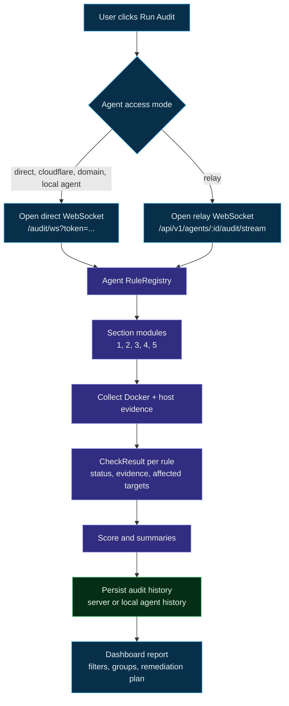
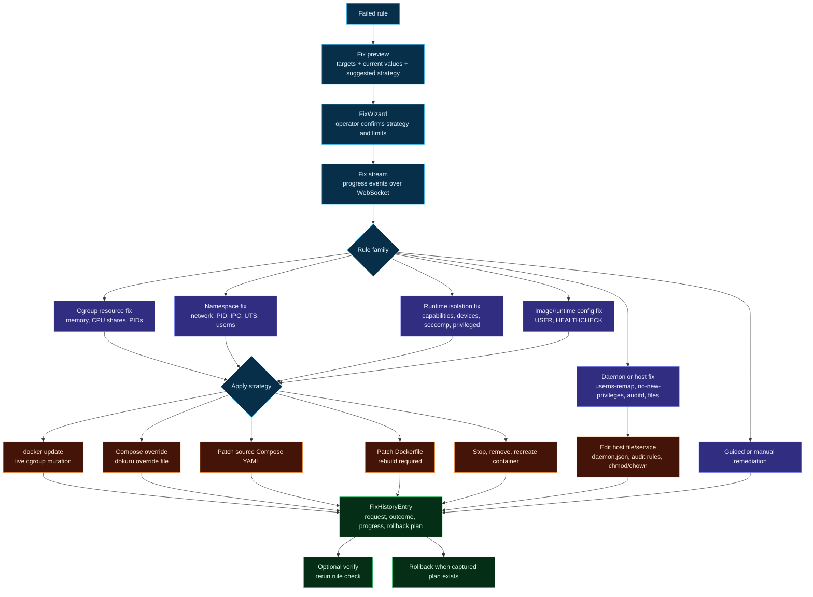
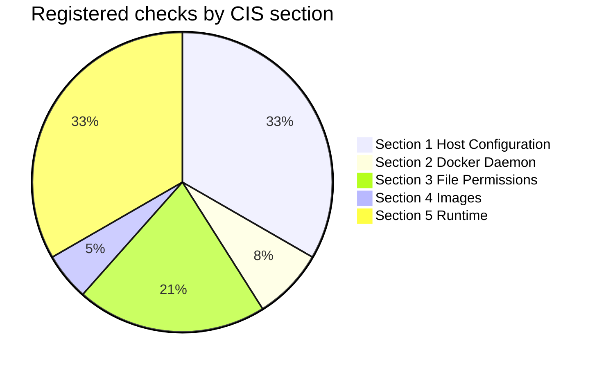
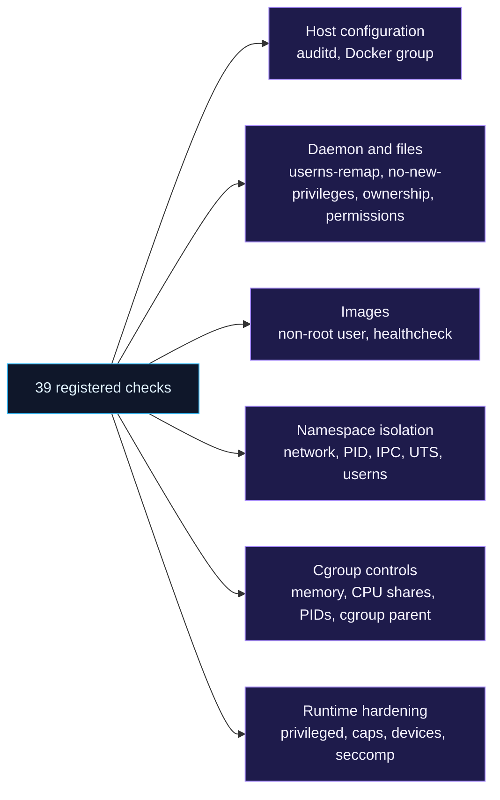

# Audit And Remediation

## Audit And Remediation Flow

### Audit Lifecycle

### Fix Lifecycle

### Fix Strategy Matrix

| Strategy | Used for | Mutates | Typical rules |
| --- | --- | --- | --- |
| `docker_update` | Live cgroup changes | Running container cgroups | `5.11`, `5.12`, `5.29` |
| `dokuru_override` | Compose-managed services | Dokuru-managed Compose override file | Runtime, image, and cgroup fixes where Compose metadata exists |
| `compose_update` | Source Compose patching | Original Compose YAML with backup | Namespace, cgroup, image/runtime settings |
| `dockerfile_update` | Strict source image remediation | Dockerfile with backup | `4.1`, `4.6` |
| `recreate` | Runtime flags that cannot be changed live | Container lifecycle | `5.5`, `5.10`, `5.16`, `5.17`, `5.21`, `5.31` |
| Guided/manual | Human decision required or unsafe to automate | None unless user applies guide | Docker group review, cgroup confirmation, custom exceptions |

## CIS Coverage

Dokuru currently registers **39 CIS Docker Benchmark v1.8.0 aligned checks** for Docker host hardening and container isolation.

| Section | Scope | Registered rules | Count |
| --- | --- | --- | ---: |
| 1 | Host Configuration | `1.1.2`, `1.1.3`, `1.1.4`, `1.1.5`, `1.1.6`, `1.1.7`, `1.1.8`, `1.1.9`, `1.1.10`, `1.1.11`, `1.1.12`, `1.1.14`, `1.1.18` | 13 |
| 2 | Docker Daemon Configuration | `2.10`, `2.11`, `2.15` | 3 |
| 3 | Docker Daemon File Permissions | `3.1`, `3.2`, `3.3`, `3.4`, `3.5`, `3.6`, `3.17`, `3.18` | 8 |
| 4 | Container Images and Build Files | `4.1`, `4.6` | 2 |
| 5 | Container Runtime Configuration | `5.4`, `5.5`, `5.10`, `5.11`, `5.12`, `5.16`, `5.17`, `5.18`, `5.21`, `5.22`, `5.25`, `5.29`, `5.31` | 13 |

### Security Pillars

### High Impact Runtime Rules

| Rule | Risk detected | Typical supported remediation |
| --- | --- | --- |
| `5.5` | Container runs privileged | Recreate without privileged mode. |
| `5.10` | Container shares host network namespace | Recreate without `--network=host`. |
| `5.11` | Container has no memory limit | `docker update --memory` or Compose memory limit. |
| `5.12` | Container has no CPU shares policy | `docker update --cpu-shares` or Compose `cpu_shares`. |
| `5.16` | Container shares host PID namespace | Recreate without `--pid=host`. |
| `5.17` | Container shares host IPC namespace | Recreate with private IPC. |
| `5.21` | Container shares host UTS namespace | Recreate without `--uts=host`. |
| `5.29` | Container has no PIDs limit | `docker update --pids-limit` or Compose `pids_limit`. |
| `5.31` | Container disables user namespace remapping | Recreate without `--userns=host`. |
