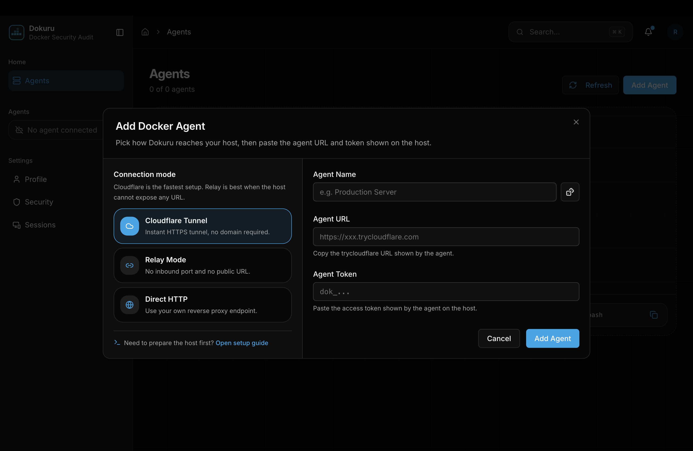
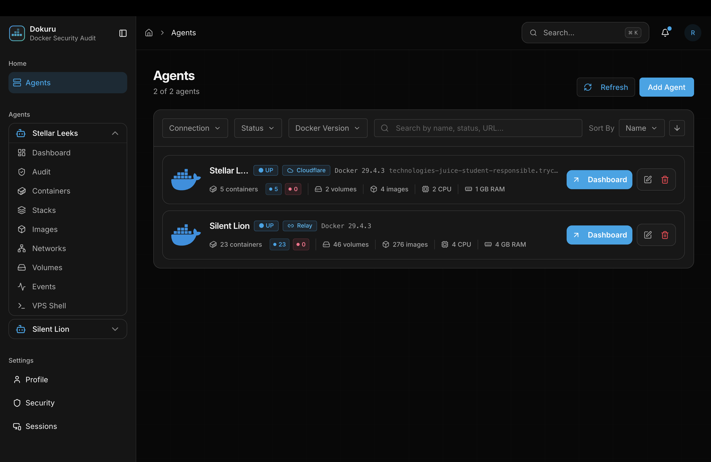
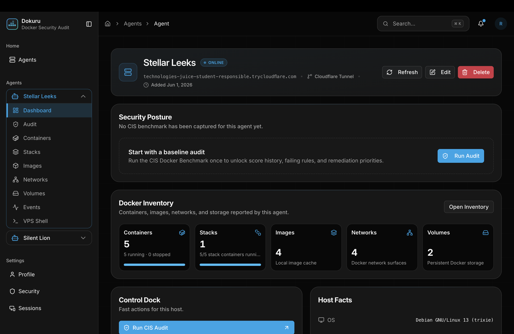
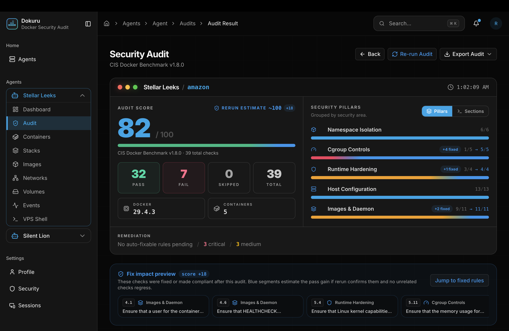
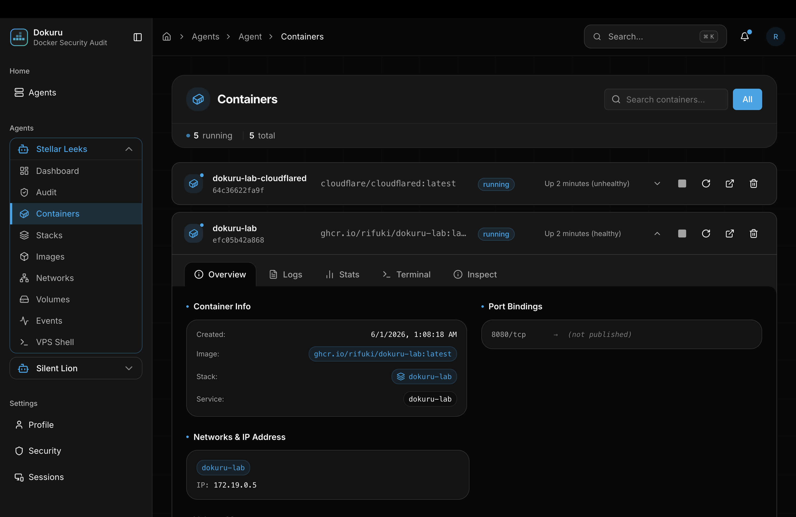

# Screenshot Gallery

This gallery is the visual walkthrough for Dokuru. The README stays short and links here when a reader wants to inspect the product flow in more detail.

## Capture Rules

- Use dark theme for public README/docs screenshots.
- Prefer clean states without transient toast notifications.
- Keep auth, landing, and highly repetitive resource pages out of the README.
- Redact real tokens, secrets, and private hostnames before publishing.

## Flow

<table>
  <tr>
    <td width="50%">
      <strong>1. First-run agents</strong> 
      Initial dashboard after login, before any Docker host has been connected.  
      
    </td>
    <td width="50%">
      <strong>2. Add Docker agent</strong> 
      Connection mode, agent URL, and one-time token entry in the add-agent modal.  
      
    </td>
  </tr>
  <tr>
    <td width="50%">
      <strong>3. Connected agents</strong> 
      Agents page after hosts have been added, with one agent expanded in the sidebar.  
      
    </td>
    <td width="50%">
      <strong>4. Agent dashboard</strong> 
      Per-agent security posture, Docker inventory, control dock, and host facts.  
      
    </td>
  </tr>
  <tr>
    <td width="50%">
      <strong>5. Audit running</strong> 
      Live CIS Docker Benchmark checks with progress, current rule, and checked containers.  
      
    </td>
    <td width="50%">
      <strong>6. Audit result</strong> 
      Score, pass/fail counts, security pillars, affected containers, and available fixes.  
      
    </td>
  </tr>
  <tr>
    <td width="50%">
      <strong>7. Fix progress</strong> 
      Controlled remediation workflow with selected rules, progress, evidence, and live output.  
      
    </td>
    <td width="50%">
      <strong>8. Container detail</strong> 
      One Docker management detail page to prove the inventory surface without repeating every resource page.  
      
    </td>
  </tr>
</table>

## Optional Extra Captures

These are useful for deeper docs, but should stay out of the README unless a release specifically focuses on Docker inventory:

- Stacks list and stack detail.
- Images list and image detail.
- Networks list and network detail.
- Volumes list and volume detail.
- Events stream.
- VPS shell, only with sanitized command output.
- Audit history.
- Fix confirmation and configuration panels.
