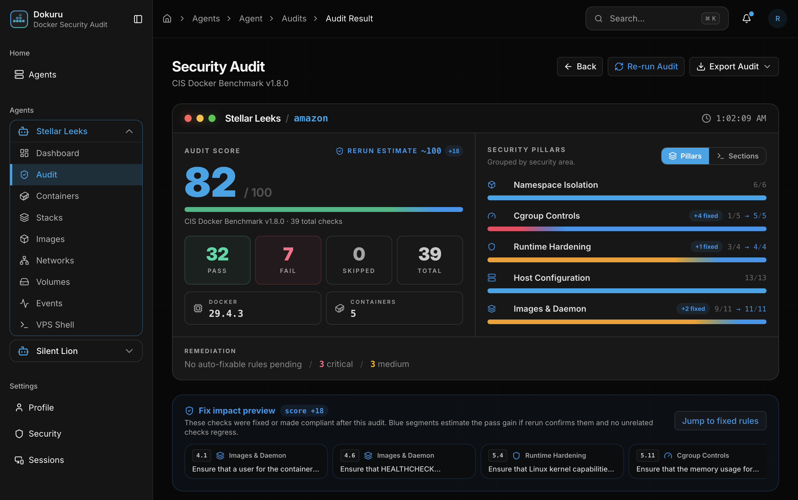
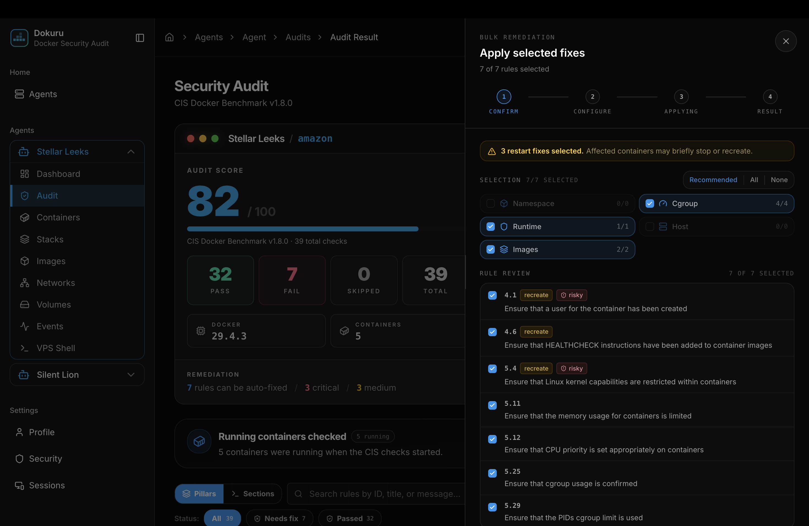
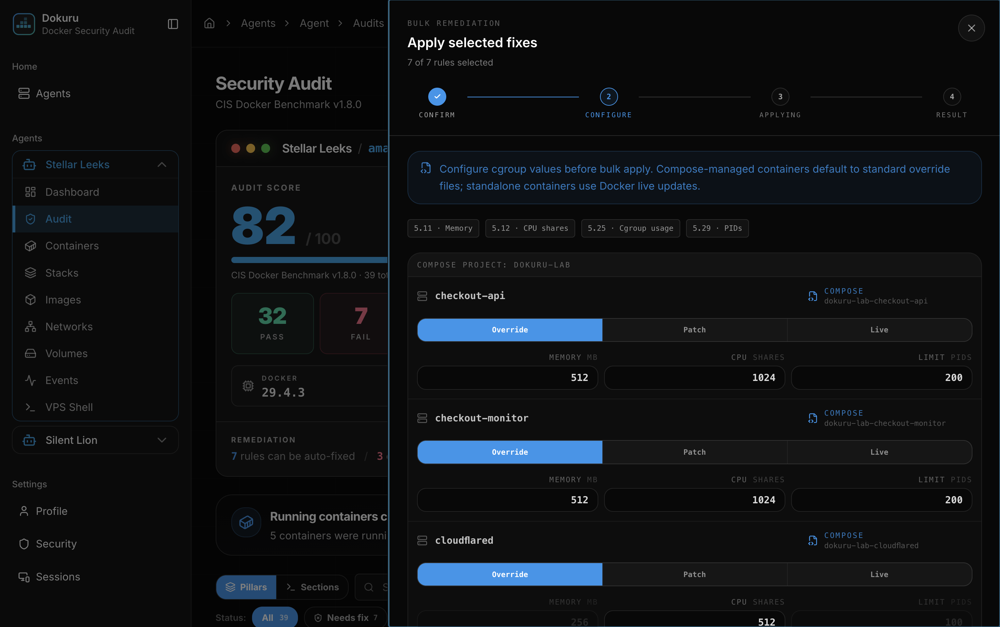
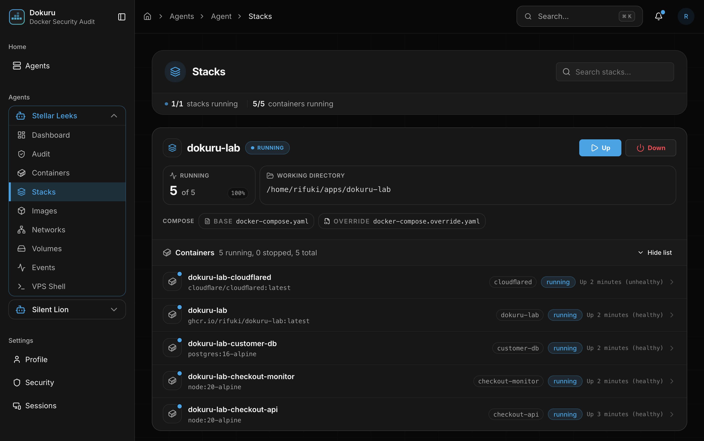
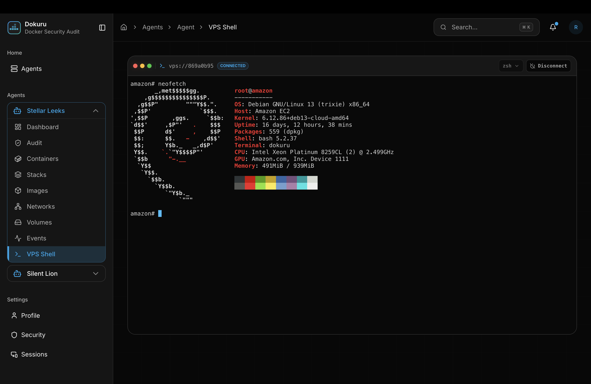

# Screenshot Gallery

This gallery is the visual walkthrough for Dokuru. The README stays short and links here when a reader wants to inspect the product flow in more detail.

## Capture Rules

- Use dark theme for public README/docs screenshots.
- Prefer clean states without transient toast notifications.
- Keep auth, landing, add-agent/setup modals, and highly repetitive resource pages out of the README.
- Keep the README preview varied: empty dashboard, live audit scan, baseline audit result, live remediation stream, then forecast result after fixes.
- Redact real tokens, secrets, and private hostnames before publishing.

## README Preview Flow

These are the screenshots that belong in the main README preview. They show the product's first useful state, audit execution, the baseline audit result, remediation in motion, and the forecast after fixes without turning the README into a long product tour.

<table>
  <tr>
    <td width="50%">
      <strong>1. Dashboard after login</strong> 
      Initial agents page before any Docker host has been connected.  
      
    </td>
    <td width="50%">
      <strong>2. Live audit scan</strong> 
      Live CIS Docker Benchmark checks with progress, current rule, and checked containers.  
      
    </td>
  </tr>
  <tr>
    <td width="50%">
      <strong>3. Baseline audit result</strong> 
      Initial score, pass/fail counts, security pillars, affected containers, and available fixes.  
      
    </td>
    <td width="50%">
      <strong>4. Audit & Fix stream</strong> 
      Live remediation progress with applied rules, evidence events, and streamed command output.  
      
    </td>
  </tr>
  <tr>
    <td colspan="2">
      <strong>5. Audit & Fix forecast result</strong> 
      Forecasted rerun score after applied fixes, with fixed pillar segments and no remaining auto-fixable rules.  
      
    </td>
  </tr>
</table>

## App Gallery Details

These screenshots stay in the docs gallery. They are useful when someone wants to inspect the deeper app flows, but they should not be added to the README preview unless the README is being redesigned around a full walkthrough.

<table>
  <tr>
    <td width="50%">
      <strong>Add Docker agent</strong> 
      Connection mode, agent URL, and one-time token entry in the add-agent modal.  
      
    </td>
    <td width="50%">
      <strong>Connected agents</strong> 
      Agents page after hosts have been added, with one agent expanded in the sidebar.  
      
    </td>
  </tr>
  <tr>
    <td width="50%">
      <strong>Agent dashboard</strong> 
      Per-agent security posture, Docker inventory, control dock, and host facts.  
      
    </td>
    <td width="50%">
      <strong>Container detail</strong> 
      One Docker management detail page to prove the inventory surface without repeating every resource page.  
      
    </td>
  </tr>
  <tr>
    <td width="50%">
      <strong>Fix confirmation</strong> 
      Bulk remediation starts with selected rules, affected pillars, and restart risk called out before any change is applied.  
      
    </td>
    <td width="50%">
      <strong>Fix configuration</strong> 
      Configure cgroup, memory, CPU share, and PID limits before the selected fixes are applied.  
      
    </td>
  </tr>
  <tr>
    <td width="50%">
      <strong>Container detail expanded</strong> 
      Expanded container row with overview tabs, image metadata, port bindings, and network address details.  
      
    </td>
    <td width="50%">
      <strong>Stack inventory</strong> 
      Compose stack summary with running containers, compose files, and per-container status.  
      
    </td>
  </tr>
  <tr>
    <td colspan="2">
      <strong>VPS shell</strong> 
      Browser shell connected to the Docker host for direct inspection and operational follow-up.  
      
    </td>
  </tr>
</table>

## Future Captures

These are useful later if the gallery needs a longer Docker inventory appendix:

- Images list and image detail.
- Networks list and network detail.
- Volumes list and volume detail.
- Events stream.
- Installer/onboarding CLI, only with generated URLs, one-time tokens, and private hostnames redacted.
- Audit history.
